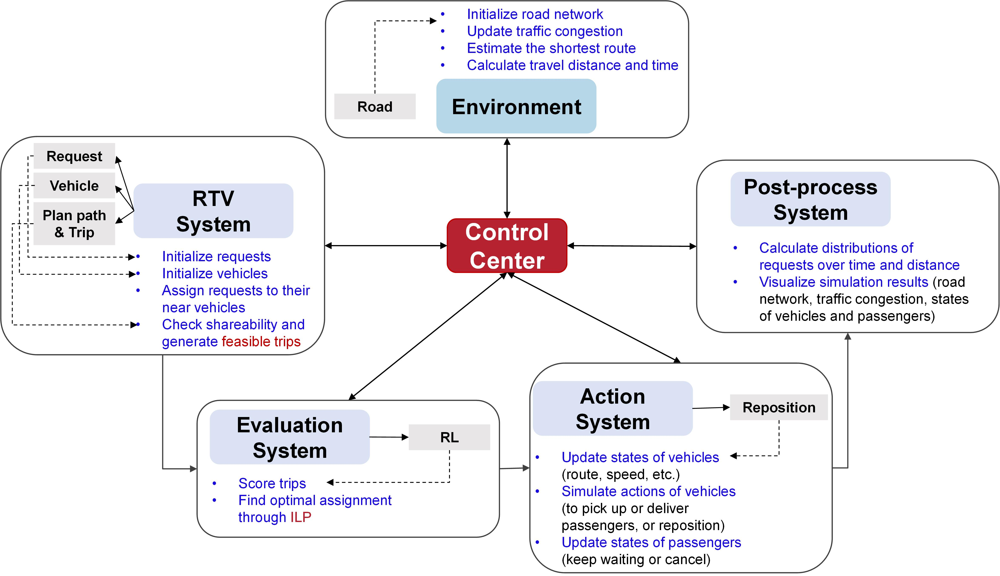

# Ride-sharing-Simulator
A high-capacity ride-sharing simulator calibrated by real request datasets and road networks

<div align="center">
    <br>
    Simulator Architecture
</div>

## Updating

- [x] Implement dispatching and repositioning algorithms of ride-sharing and ride-sourcing
- [x] Add traffic flow models to measure traffic congestion, speed, and carbon emissions
- [x] Implement 2D visualization
- [ ] Provide implementation for Reinforcement Learning algorithms
- [ ] Provide implementation for car-following models
- [ ] Provide implementation for highly realistic 3D visualization


## Setup
1. Install dependencies and libraries
``` bash
pip install -r requirements.txt
```
2. Download [Road Network](https://drive.google.com/file/d/1plVhAfyD0ZtiFEfIHL8HYrPuLczdtvH0/view?usp=share_link) into **data**


## Simulation

### Run the demo
```bash
python simulation.py --cfg ./config/test.yaml  --DrawResult True
```

### Simulation results
[](https://youtu.be/upBATpfreoI "Demonstration for simulation results")


## Dispatching Algorithm
<div align="center">
    <br>
</div>
**Dispatching Algorithm.** (a) Passengers are preassigned to vehicles within their matching areas; then (b) each vehicle will be potentially scheduled with multiple passengers. (c) The platform checks the shareability of each vehicle's potential passengers by planning the shortest routes and verifying pickup and detour time constraints, e.g., Passengers 1 and 2 can share Vehicle 1, but Passengers 2 and 3 cannot share Vehicle 2 due to the detour time constraint. (d) RTV-graph can be established to connect all potential trips (including one or more requests) to vehicles. (e) The optimal matching results are obtained via ILP. (f) Vehicles pick up and deliver passengers according to the matching results of (e) and the planned shortest routes of (c).


## References

```
@article{chen2023quantifying,
  title={Quantifying traffic emission reductions and traffic congestion alleviation from high-capacity ride-sharing},
  author={Chen, Wang and Ke, Jintao and Chen, Xiqun},
  journal={arXiv preprint arXiv:2308.10512},
  year={2023}
}
```

```
@article{chen2023scaling,
  title={Scaling Laws of Dynamic High-Capacity Ride-Sharing},
  author={Chen, Wang and Ke, Jintao and Yang, Linchuan},
  journal={arXiv preprint arXiv:2305.07236},
  year={2023}
}
```

